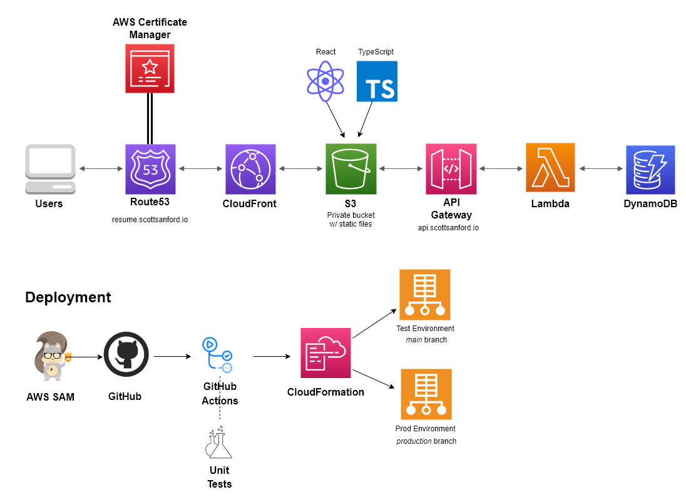

# Cloud Resume

A serverless resume web app built entirely with AWS Serverless technologies.

  

Production Environment: [https://resume.scottsanford.io](https://resume.scottsanford.io)

Test Environment: [https://testresume.scottsanford.io](https://testresume.scottsanford.io)

## Goal

To replicate a real-world software development lifecycle (SDLC) scenario!

Today, most companies rely on multiple engineers to complete one part of the stack. This project represents all 3 phases of the stack (Frontend, Backend, DevOps/Infrastructure).

Below are my considerations for all 3 phases.

## Phase I (Frontend)

The frontend is built with React, TypeScript, & CSS Modules. These are very common frontend technologies used by many engineering teams. Additionally, unit tests were written to ensure confidence when pushing environment deployments. While building the frontend, these were some other considerations I kept in mind:

- Site responsiveness (media queries)
- Consistent theming (fonts, colors, padding)
- Gracefully handle different states (success and failures)

## Phase II (Backend)

The backend consists of 3 different AWS Serverless technologies: API Gateway, Lambda, & DynamoDB.

1. API Gateway

    The entry point into the REST API. There are 2 different environment endpoints used in this project: [testapi.scottsanford.io](http://testapi.scottsanford.io) & api.scottsanford.io (*test* and *production* respectively).

2. Lambda

    I decided to use TypeScript to built out my function. Using AWS SAM, I was able to transpile my function code into JavaScript in order for my function to run in a NodeJS Lambda environment. Here were some additional considerations I made:

    - Using the JavaScript AWS-SDK V3. Version 3 is a modular approach to V2 while also including TypeScript support.
    - Separation of concerns. Each file should include a singular purpose. This also helped out when writing unit tests.
    - Unit test lambda function using Jest.
    - ESLint and Prettier to fix syntax and linting.

    While this project was small in scope, here were some improvement considerations if I were to consider making additional improvements:

    - Lambda layers for sharing code libraries across multiple functions. Helps reduce size of upload archives and faster deployments.
    - Consider using AWS X-Ray for a distributed tracing system. AWS X-Ray helps developers analyze and debug production, distributed applications, such as those built using a microservices architecture.
3. DynamoDB

    This project uses AWS’s Serverless NoSQL Database, DynamoDB. Using a simple database item, I was able to write a single API call to update and retrieve the app’s visitor count. While in most applications you would typically use separate API calls (GET & POST), I decided to take advantage of Dynamo’s `ReturnValues: 'UPDATED_NEW'`. This returns the updated value after an attribute has been updated.

## Phase III (DevOps/Infrastructure)

1. Route53 & AWS Certificate Manager

    I purchased my own domain scottsanford.io to host my application. This domain was purchased through Route53 and am using a public hosted zone. I am also using the AWS Certificate Manager to manage SSL/TLS certificates to ensure encryption communication between the client and server.

2. CloudFront

    I am using a CloudFront distribution in front of my static files located in my S3 bucket. This speeds up distribution of the static files to end users. Additionally, I am using an Origin Access Identity (OAI) to restrict users from directly accessing my static files. Users must go directly through the CloudFront distribution.

3. S3

    Static files are stored as object storage in an S3 bucket. The bucket is kept private while ensuring the CloudFront distribution is the only accessible identity to the bucket.

4. AWS SAM

    This entire project uses AWS SAM to build and deploy my serverless stack. Using a `template.yaml` file to declaratively build out resources, I am able to

    One SAM consideration: I had to use different stack names per environment. If I used a single stack name, the latest environment deployment would override the existing resources instead of create or modify the correct resource.

5. CI/CD Pipeline with GitHub Actions

    Two workflows were created for this project: Infrastructure and Frontend. These workflows are pushed on specific branches (*main* & *production*) as well as when certain file changes have been committed. Unit tests are automatically ran to ensure confidence before deployments. Deployments happen automatically using AWS credentials stored in GitHub Actions Secrets.

    When deploying static files up to S3, I also invalidate the CloudFront cache so users can see the latest changes.

6. Multiple Environments

    I’ve built out multiple environments (*test* and *production*) to simulate an actual team workflow. Each environment corresponds to a specific branch: *main* for the testing environment and *production* for the production environment. Using multiple environments keeps a team productive. Having multiple environments enables a team to work on parallel development efforts. If there are several people working on the app, using a different environment helps keep the team productive. This also provides the team with a level of confidence.

    In this project example, the test environment would be the first line of defense against bugs. Here, I can safely deploy new changes without immediately affecting production. Once I have thoroughly tested the recent changes, I can create a Pull Request to merge my *main* branch → *production* branch.

## Security Considerations

An important part in developing any application is managing security. Here were the top security considerations I took into account:

1. CORS. Restricting the request origins in my server-side Lambda function where a call originates from.
2. Use an Origin Access Identity (OAI) on S3 bucket. This keeps your bucket private while restricting access to only your CloudFront distribution.
3. Enabling SSL/TLS via ACM to ensure communication is encrypted between privacy client & server. This allows the website to use https instead of http.
4. GitHub Actions Secrets. Do not store sensitive information such as AWS credentials in plaintext inside your workflows. Instead, I stored them in secrets that workflows tap into.

Other considerations: Given the small scope of this project, I would have used AWS System’s Manager Parameter Store or Secrets Manager. However, I felt that would have been overkill in this project. A good use case would be if I had database credentials or if I needed secrets rotation.

Additionally, I also considered using a Lambda Authorizer that would control access to API requests. This was out of the scope for this project but can easily been added in given the serverless nature of the project.
